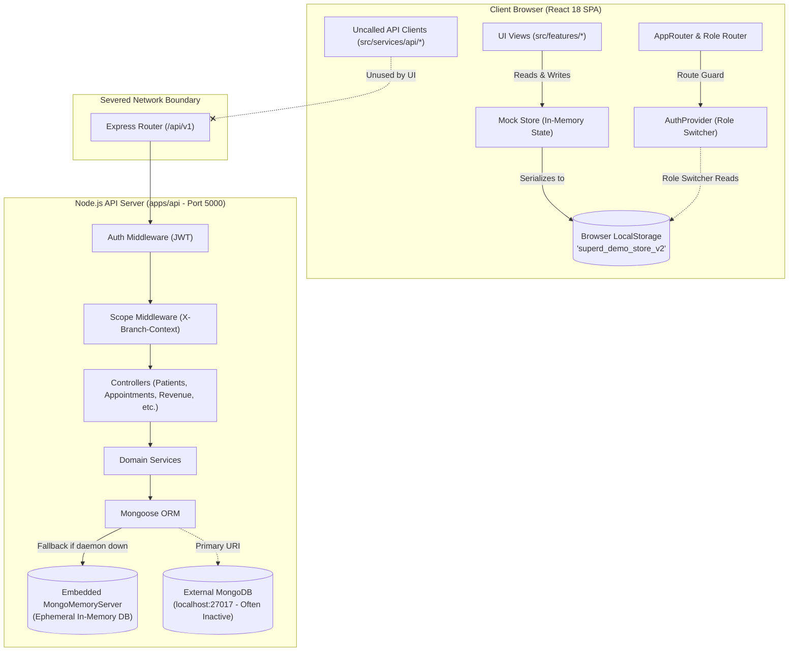
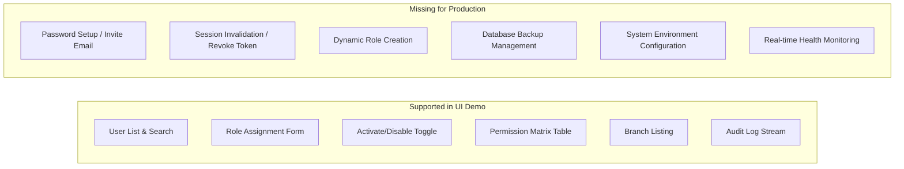
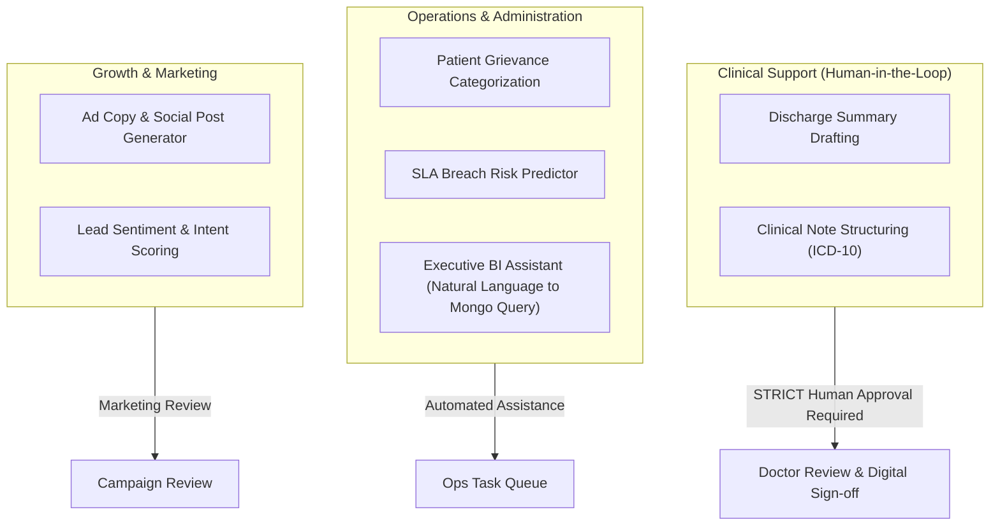
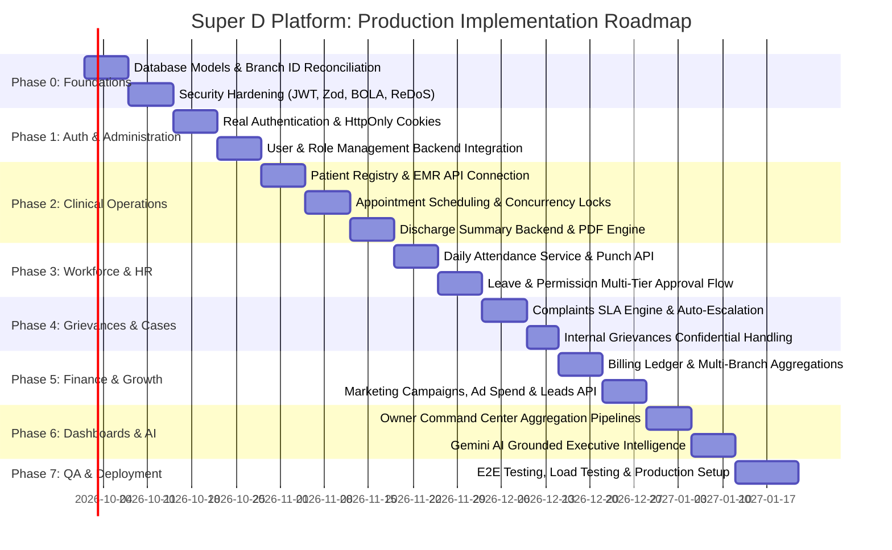
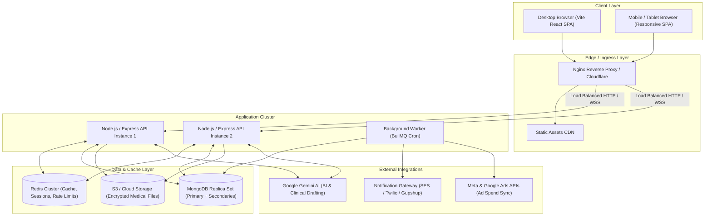

# Production-Readiness Architecture & Security Audit Report
**Hospital Management & Administration Platform (Super D / Aarogya)**
*Author: Principal Full-Stack, Security, QA & AI Systems Architect*  
*Date of Audit: September 23, 2026*  
*Scope: Full Codebase Audit (`src/`, `apps/api/`, configurations, dependencies, data flows)*  
*Target Status: Pre-Production Architectural & Security Verification*  

---

## 1. Executive Summary

A comprehensive architectural, security, quality assurance, and operational audit of the **Hospital Management & Administration Platform** was conducted. The platform is designed as a multi-branch enterprise healthcare administration system serving four primary branch locations across Tamil Nadu: **Trichy Main Hospital**, **Chennai Super Speciality**, **Madurai City Hospital**, and **Pudukkottai Healthcare Center**.

The system is architected to serve role-specific operational dashboards for at least nine core personas: **Hospital Owner**, **Global Admin / Technical Assistant**, **Branch Manager**, **Doctor / Branch Doctor**, **HR / HR Manager**, **Finance Manager / Accounts**, **Marketing Manager**, **Complaints & Query Manager**, and **Staff / Receptionist**.

### Key Audit Findings

> [!CAUTION]
> **Primary Architectural Finding: 100% Client-Side Mock Isolation**  
> While the user interface is exceptionally polished, responsive, and feature-complete, **the active frontend application does NOT communicate with any database or persistent backend service**. All data across all 15+ functional modules is maintained in-memory and serialized to the browser's `localStorage` via a mock store (`src/services/mock/mockStore.ts` under key `superd_demo_store_v2`).

1. **Frontend / Backend Disconnect**:  
   An Express 4 + TypeScript + Mongoose backend exists in `apps/api/`, and typed API client interfaces exist in `src/services/api/` (`patientApi.ts`, `appointmentApi.ts`, etc.). However, **zero UI components import or consume these API clients**. Every feature view directly imports and executes mock services (`@/services/mock/*`). The only component with an active HTTP hook is the `HospitalIntelligenceDrawer.tsx` (which calls `ownerIntelligenceApi.ts`) and `AuthProvider.tsx` (which attempts a fire-and-forget login against `authApi.ts` with dummy credentials).
2. **Missing Backend Domains**:  
   The backend in `apps/api/` implements partial models and controllers for Patients, Appointments, Employees, Leave, Complaints, and Revenue. However, **entire functional modules have zero backend representation**:
   - **Advertisement & Campaign Management** (`src/features/advertisements/`): No routes, controllers, or database models.
   - **Digital Marketing Analytics** (`src/features/marketing/`): No routes, controllers, or database models.
   - **Daily Staff Attendance** (`src/features/attendance/`): No daily check-in/out model or historical attendance persistence.
   - **Patient Discharge Summaries** (`src/features/patients/PatientDischargeSummaryView.tsx`): No discharge summary model or routes.
   - **Custom Reporting & Aggregation Engine** (`src/features/reports/`): No reporting pipeline or export service.
3. **Severe Security & Authorization Vulnerabilities**:
   - **Client-Side Role Switching**: User roles and permissions are enforced purely client-side via `localStorage.getItem('superd_demo_role')` (`src/app/providers/AuthProvider.tsx`, Line 25). Any user can escalate privileges to "Super Admin" or "Hospital Owner" by modifying `localStorage`.
   - **Unauthenticated Backend Fallback**: `apps/api/src/config/env.ts` provides a hardcoded fallback JWT secret (`'aarogya-hospital-secret-key-2026-super-speciality'`).
   - **0% Validation Middleware Adoption**: A Zod schema validation middleware (`validate.middleware.ts`) was written in `apps/api/src/common/validation/`, but **is not mounted on a single route in the entire backend**. All request bodies enter controllers completely unvalidated by schema.
   - **Broken Object-Level Authorization (BOLA/IDOR)**: In `apps/api/src/modules/patients/patient.controller.ts`, `getPatientById`, `updatePatient`, and `getMedicalRecords` do not enforce `req.scopeFilter`. Any authenticated user with basic view permissions can access or update any patient's records across any branch.
   - **ReDoS Vulnerability**: `patient.service.ts` (Line 11) and `knowledge.service.ts` build unescaped regular expressions directly from user search queries (`new RegExp(search, 'i')`), enabling event-loop denial-of-service attacks.
   - **Unencrypted Protected Health Information (PHI) in LocalStorage**: Complete patient rosters, diagnoses, medical records, staff grievances, and daily income vouchers are stored in plaintext in the user's browser.
4. **Data Contract & Branch ID Mismatches**:  
   Frontend mock data and UI forms use branch identifiers `branch-try`, `branch-chn`, `branch-mdu`, and `branch-pdk`. In contrast, the backend seeds and branch mappings in `apps/api/src/seed/seedData.ts` and `patient.service.ts` expect `branch-trichy`, `branch-chennai`, `branch-madurai`, and `branch-pudukkottai`. Connecting the frontend directly to the current backend without reconciliation will trigger immediate foreign key and routing failures.
5. **Simulated AI Capabilities**:  
   The "Hospital Intelligence" executive assistant in `apps/api/src/modules/owner-intelligence/ownerIntelligence.service.ts` does not integrate with any Large Language Model or Gemini API. It uses deterministic keyword substring matching (`cleanQuery.includes('revenue')`) returning static string templates. `GEMINI_API_KEY` is declared in `env.ts` but never referenced in code.

---

## 2. Current Architecture

### Architecture Diagram: As-Built State



### Architectural Characteristics

| Layer | Implementation Technology | Production Readiness | Architectural Flaw / Debt |
| :--- | :--- | :--- | :--- |
| **Frontend Framework** | React 18.3.1, Vite 6.0.3, TypeScript 5.6.3 | **READY** | SPA architecture is clean; routing and layout shells are well-structured. |
| **Styling & Design** | Tailwind CSS 3.4.17, Lucide Icons | **READY** | Rich, responsive design system. Consistent medical color palette and clean tokens. |
| **Frontend State** | React Context (`AuthProvider`, `BranchProvider`, `ToastProvider`) + `MockStore` | **REQUIRES IMPLEMENTATION** | No server-cache layer (React Query / TanStack Query). All state lives in local storage. |
| **API Client Layer** | Native `fetch` wrapper in `src/services/api/httpClient.ts` | **PARTIALLY READY** | Client exists with JWT injection, but 80% of required endpoints are missing; UI does not use it. |
| **Backend Framework** | Node.js, Express 4.19.2, TypeScript 5.4.5 | **PARTIALLY READY** | Basic modular structure exists, but lacks rate limiting, logging aggregation, and validation. |
| **Database & ORM** | MongoDB with Mongoose 8.4.1 | **PARTIALLY READY** | 10 models implemented; 8 critical hospital domain models completely absent. Falls back to ephemeral memory. |
| **Security & RBAC** | Custom JWT + Middleware in `apps/api/src/common/` | **REQUIRES IMPLEMENTATION** | BOLA vulnerabilities; client-side privilege escalation; hardcoded secret keys. |
| **AI Systems** | Deterministic string-matching heuristics | **REQUIRES IMPLEMENTATION** | Zero LLM integration; Gemini SDK not installed; keyword checks masquerading as AI. |

---

## 3. Project Structure Audit

### Monorepo & Folder Hierarchy

The repository is structured as a quasi-monorepo containing a root Vite project and a sub-application in `apps/api/`:

```
Super-D/
├── apps/
│   └── api/                         # Express 4 + Mongoose Backend
│       ├── src/
│       │   ├── common/              # Auth, RBAC, Scope, Errors, Events
│       │   ├── config/              # Constants, Database, Env
│       │   ├── modules/             # Domain modules (Patients, Appointments, Revenue, etc.)
│       │   ├── seed/                # Backend seed runner and mock data
│       │   ├── app.ts               # Express application configuration
│       │   └── server.ts            # Server entrypoint (Port 5000)
│       ├── package.json             # Backend dependencies
│       └── tsconfig.json            # Backend TypeScript configuration
├── public/                          # Static assets
├── server/                          # STALE / DEAD CODE: Legacy Node server stub
├── src/                             # React 18 Frontend Application
│   ├── app/                         # Providers (Auth, Branch, Toast) & Router
│   ├── components/                  # Layout, UI primitives, Charts, Tables
│   ├── data/seed/                   # 15+ Mock seed data files
│   ├── features/                    # Feature views (18 view components)
│   ├── lib/                         # Utility functions (formatINR, formatDate)
│   ├── routes/                      # Route definitions & Role permissions matrix
│   ├── services/
│   │   ├── api/                     # Typed API clients (HTTP fetch layer)
│   │   └── mock/                    # Mock services (localStorage mutation layer)
│   ├── styles/                      # Tailwind index.css
│   ├── types/                       # Shared TypeScript domain interfaces
│   ├── App.tsx                      # Root component
│   └── main.tsx                     # Vite entrypoint
├── package.json                     # Root frontend package.json
├── tailwind.config.js               # Tailwind design tokens
├── tsconfig.json                    # Frontend TypeScript configuration
└── vite.config.ts                   # Vite bundler configuration (with proxy to :5000)
```

### Dependency Audit

#### Frontend (`package.json`)
- **Core Dependencies**: `react` (^18.3.1), `react-dom` (^18.3.1), `react-router-dom` (^6.28.0), `recharts` (^2.15.0), `lucide-react` (^0.468.0), `clsx` (^2.1.1), `tailwind-merge` (^2.5.5).
- **Missing Critical Dependencies**:
  - `@tanstack/react-query`: Needed for server state management, caching, retry, and background revalidation.
  - `zod` / `react-hook-form`: Needed for production-grade form state management and schema validation.
  - `axios` (optional, but recommended for interceptor flexibility and upload progress tracking).

#### Backend (`apps/api/package.json`)
- **Core Dependencies**: `express` (^4.19.2), `mongoose` (^8.4.1), `jsonwebtoken` (^9.0.2), `bcryptjs` (^2.4.3), `zod` (^3.23.8), `helmet` (^7.1.0), `cors` (^2.8.5), `morgan` (^1.10.0), `dotenv` (^16.4.5), `uuid` (^9.0.1).
- **Dev Dependencies**: `mongodb-memory-server` (^9.2.0), `ts-node-dev` (^2.0.0), `typescript` (^5.4.5).
- **Missing Critical Dependencies**:
  - `express-rate-limit`: Needed to mitigate brute-force and DoS attacks.
  - `multer` or `@aws-sdk/client-s3`: Essential for medical record, lab attachment, and proof-of-expense file uploads.
  - `@google/genai` or `@google/generative-ai`: Required for real Gemini AI intelligence.
  - `winston` / `pino`: Production structured JSON logging (Morgan alone is insufficient).
  - `ioredis`: Required for caching, session revocation, and distributed locking.

### Dead Code & Architectural Anomalies
1. **Legacy `server/` Directory**:  
   Contains `server/index.js` and `server/package.json`. This is an obsolete legacy stub that predates `apps/api/`. It should be archived or removed during cleanup.
2. **Orphaned API Clients in `src/services/api/`**:  
   `patientApi.ts`, `appointmentApi.ts`, `leaveApi.ts`, `complaintApi.ts`, `revenueApi.ts`, `branchApi.ts`, and `notificationApi.ts` exist with clean signatures but are **0% referenced** in `src/features/*`.
3. **Database Fallback Mechanism in Production**:  
   `apps/api/src/config/database.ts` (Lines 17-34) silently boots `MongoMemoryServer` if the real MongoDB connection fails. In production, this causes catastrophic silent data loss whenever the container or node process restarts.

---

## 4. Complete Feature Inventory

| Module | Feature Name | Route / Path | Primary Components Used | Active Data Source | Status | Backend / DB Dependency | Production Work Required |
| :--- | :--- | :--- | :--- | :--- | :---: | :--- | :--- |
| **Auth** | Role Switcher & Mock Login | `/login` | `LoginView`, `AuthProvider` | Local state / `localStorage` | **B** (Mock) | `POST /auth/login`, `User` entity | Implement secure session cookies, JWT refresh tokens, 2FA, and password hashing. |
| **Dashboard** | Hospital Owner Command Center | `/dashboard` | `OwnerDashboardView`, `KPICard`, `RevenueChart` | `dashboardService` + hardcoded constants | **C** (Static/Mock) | `GET /owner/metrics`, MongoDB aggregations | Replace static arrays with dynamic aggregation pipelines across Revenue, Appointments, Beds. |
| **Dashboard** | Global Admin Command Center | `/dashboard` (Admin role) | `AdminDashboardView`, `DataTable` | `dashboardService` + mock store | **B** (Mock) | `GET /admin/health`, `AuditLog` collection | Wire real system health metrics, MongoDB server stats, and live audit event stream. |
| **Dashboard** | Role Dashboards (Doctor, HR, Finance, etc.) | `/dashboard` | `RoleDashboardView`, specialized sub-views | `dashboardService` | **B** (Mock) | Role-specific summary endpoints | Create dedicated aggregations per role scope (e.g. Doctor's daily queue, HR pending leaves). |
| **Patients** | Patient Directory & Search | `/patients` | `PatientListView`, `DataTable`, `MobileRecordCard` | `patientService` (mock store) | **D** (Local State) | `GET /patients?branchId=...&search=...` | Connect to `patientApi.ts`; implement server-side pagination and sanitization. |
| **Patients** | Patient Registration | `/patients` (modal) | `PatientListView`, `Modal` | `mockStore.patients` array | **D** (Local State) | `POST /patients` | Add server-side uniqueness check on Phone/Aadhaar/UHID; validate schema with Zod. |
| **Patients** | Patient Profile & EMR | `/patients/:id` | `PatientProfileView`, `Card`, `Badge` | `mockStore.patients`, `medicalRecords` | **D** (Local State) | `GET /patients/:id`, `GET /patients/:id/records` | Connect to backend; implement field-level access security for sensitive clinical history. |
| **Discharge** | Patient Discharge Summary | `/patient-discharge` | `PatientDischargeSummaryView` | `mockStore.superDDischarges` | **E** (localStorage) | Missing backend module (`DischargeSummary`) | Design `DischargeSummary` model, approval workflow (Doctor -> Superintendent), and PDF generator. |
| **Appointments** | Appointment Management | `/appointments` | `AppointmentView`, `DataTable` | `appointmentService` (mock store) | **D** (Local State) | `GET /appointments`, `Appointment` model | Connect to `appointmentApi.ts`; implement real doctor slot availability checks and collision locks. |
| **Appointments** | Book / Reschedule / Cancel | `/appointments` (modals) | `AppointmentView`, `Modal` | `mockStore.appointments` array | **D** (Local State) | `POST /appointments`, `PATCH /appointments/:id` | Add SMS/Email confirmation triggers; synchronize doctor calendar slots. |
| **Workforce** | Employee Directory | `/employees` | `EmployeeListView`, `DataTable`, `Drawer` | `employeeService` (mock store) | **D** (Local State) | `GET /employees`, `Employee` model | Create `employeeApi.ts` client; link employee profile to system user credentials. |
| **Workforce** | Attendance Management | `/attendance` | `AttendanceManagementView` | Hardcoded array (Lines 51-58) + mock store | **C** (Hardcoded) | Missing backend module (`AttendanceRecord`) | Build daily check-in/out model, biometric/geo-fence sync API, and monthly payroll calculation. |
| **Workforce** | Leave & Permission Requests | `/leave-permission` | `EmployeeLeaveRequestView` | `mockStore.superDLeaveRequests` | **E** (localStorage) | `POST /leave-requests`, `LeaveRequest` model | Wire to backend; add leave balance quota verification and overlap checks. |
| **Workforce** | Multi-Tier Leave Approval | `/leave-approval` | `LeaveApprovalView`, `Modal` | `mockStore.superDLeaveRequests` | **E** (localStorage) | `PATCH /leave-requests/:id/review` | Implement Manager -> HR multi-level state machine with audit trail and notification triggers. |
| **Support** | Employee Concerns / Grievances | `/grievances` | `GrievancesView`, `Modal` | `mockStore.superDGrievances` | **E** (localStorage) | Missing backend module (`Grievance`) | Design internal grievance model with strict anonymity/confidentiality flags and escalation rules. |
| **Support** | Patient Complaints & SLA Escalation | `/complaints` | `ComplaintsDashboardView`, `Drawer` | `complaintService` (mock store) | **D** (Local State) | `GET /complaints`, `Complaint` model | Connect to `complaintApi.ts`; implement automated background cron for overdue SLA breaches. |
| **Marketing** | Campaign & Ad Spend Tracker | `/advertisements` | `AdvertisementManagementView` | `mockStore.superDAds` | **E** (localStorage) | Missing backend module (`Advertisement`) | Build ad spend, platform tracking (Meta/Google), UTM link generator, and CPL calculations. |
| **Marketing** | Digital Marketing Performance | `/marketing` | `MarketingDashboardView`, `DataTable` | `marketingService` (mock store) | **D** (Local State) | Missing backend module (`Campaign`, `Lead`) | Connect to backend; build social media metrics ingestion and lead attribution pipeline. |
| **Finance** | Revenue & Daily Vouchers | `/revenue-accounts` | `RevenueAccountsView`, `Modal` | `mockStore.superDTransactions` | **E** (localStorage) | `GET /income-records`, `IncomeRecord` model | Reconcile transaction schema with `IncomeRecord`; connect to `revenueApi.ts`; enforce receipt sequences. |
| **Finance** | Income Reports & Analytics | `/income-reports` | `IncomeReportsView`, Recharts | Hardcoded constants (`superDSeed.ts`) | **C** (Hardcoded) | Missing backend reporting aggregation API | Build dynamic date-range aggregation pipeline grouping by branch, category, and payment mode. |
| **Finance** | Executive Finance Analytics | `/finance` | `FinanceDashboardView`, Recharts | `financeService` (mock store) | **D** (Local State) | `GET /revenue/summary`, MongoDB `$facet` | Replace client-side math with auditable server-side ledger aggregations. |
| **Admin** | User Provisioning | `/users` | `UserListView`, `Modal` | `userService` (mock store) | **D** (Local State) | `GET /users`, `POST /users`, `User` model | Build `userApi.ts`; implement password generation, email invite flow, and session revoking. |
| **Admin** | Role & Permission Matrix | `/roles` | `RolesPermissionView`, `Card` | `roleService` (mock store) | **D** (Local State) | `GET /roles`, `PATCH /roles/:id`, `Role` model | Wire dynamic RBAC policy updates; persist permissions in database instead of static TS file. |
| **Admin** | Branch Management | `/branches` | `BranchListView`, `Card` | `branchService` (mock store) | **D** (Local State) | `GET /branches`, `Branch` model | Connect to `branchApi.ts`; add CRUD capabilities for branch metadata, beds, and departments. |
| **Admin** | System Audit Logs | `/settings` / `/dashboard` | `AdminDashboardView` | `auditService` (mock store) | **D** (Local State) | `GET /audit-logs`, `AuditLog` model | Wire live immutable audit log stream with IP address, user-agent, and before/after diffs. |
| **AI** | Hospital Intelligence Assistant | Drawer (all views) | `HospitalIntelligenceDrawer` | `ownerIntelligenceApi.ts` -> Express | **F** (Calling API) | `POST /owner/intelligence/query` | Replace deterministic keyword checks with Gemini LLM Function Calling and database grounding. |

*Status Legend: A = Fully functional with backend; B = UI-only/mock; C = Static/hardcoded data; D = Local state only; E = LocalStorage persistence; F = Calling API (mock backend); G = Real production backend; H = Partially integrated; I = Missing entirely; J = Broken or risky.*

---

## 5. Frontend Audit

### Component Architecture & Modularity
- **App Shell & Navigation** (`src/components/layout/`):  
  The layout shell (`AppShell.tsx`, `DesktopSidebar.tsx`, `TopNav.tsx`, `MobileNav.tsx`) is designed with high visual quality. It supports responsive collapsible navigation, role-scoped sidebar sections, notification popovers, and a global branch selector.
- **Design Tokens & Styling** (`src/styles/index.css`):  
  Built with vanilla Tailwind CSS using a refined healthcare palette (`clinical-500` teal, `navy-900`, `brand-blue`). No ad-hoc conflicting utility frameworks were detected.
- **Table Components** (`src/components/tables/`):  
  `DataTable.tsx` provides clean sorting, client-side pagination, empty states (`TableEmptyState.tsx`), and responsive mobile record card fallbacks (`MobileRecordCard.tsx`).
- **Feedback & Overlays** (`src/components/ui/`):  
  Accessible, well-styled modals (`Modal.tsx`), slide-over drawers (`Drawer.tsx`), skeleton loaders (`Skeleton.tsx`), and KPI metric cards (`KPICard.tsx`).

### Frontend Vulnerabilities & Technical Debt
1. **Uncontrolled Form States**:  
   Forms across `UserListView.tsx`, `PatientListView.tsx`, and `AttendanceManagementView.tsx` rely on numerous disconnected `useState` hooks without centralized form schema validation.
2. **Global State Mutation Leakage**:  
   The application subscribes directly to `mockStore.subscribe(...)` inside view-level `useEffect` hooks. In high-frequency operational environments, this pattern triggers cascading re-renders across the entire component tree.
3. **No Optimistic Update Rollbacks**:  
   Because state mutations operate directly on in-memory arrays, there is no abstraction for handling network latency, offline queuing, or rollback upon server error.

---

## 6. Mock / Static Data Audit

The codebase contains an extensive mock data layer. Below is a comprehensive audit of all hardcoded arrays, dummy records, and simulated stores.

| File Path | Code Location | Mocked Content / Purpose | Required Backend Data Source | Required Database Entity |
| :--- | :--- | :--- | :--- | :--- |
| `src/services/mock/mockStore.ts` | Lines 56–126 | Entire hospital state tree serialized to localStorage key `superd_demo_store_v2`. | REST / GraphQL API endpoints | All Database Collections |
| `src/features/dashboards/OwnerDashboardView.tsx` | Lines 87–92 | Hardcoded 4-month revenue comparison across Trichy, Chennai, Madurai, PDK. | Monthly revenue aggregation service | `IncomeRecord` |
| `src/features/dashboards/OwnerDashboardView.tsx` | Lines 95–102 | Hardcoded category distribution donut chart (Pharmacy, OP, Lab, etc.). | Category breakdown aggregation pipeline | `IncomeRecord` |
| `src/features/dashboards/AdminDashboardView.tsx` | Lines 202–209 | Static system health (`apiStatus: 'Operational'`, `databaseUptime: '99.98%'`). | Real-time health check endpoint | System Process Stats |
| `src/features/attendance/AttendanceManagementView.tsx` | Lines 51–58 | Static daily attendance records for 6 employees (`EMP-012`, `EMP-021`, etc.). | Daily attendance check-in service | `AttendanceRecord` |
| `src/features/reports/IncomeReportsView.tsx` | Lines 35–46 | Hardcoded `BRANCH_BAR_DATA` and `DONUT_DATA` for income reports. | Analytics reporting service | `IncomeRecord` |
| `src/data/seed/superDSeed.ts` | Lines 26–180 | Hardcoded transaction ledger, advertisements, and leave requests. | Relational financial & HR services | `IncomeRecord`, `LeaveRequest`, `Advertisement` |
| `src/data/seed/patients.ts` | Lines 1–120 | 10 static patient profiles with mock UHIDs, contact info, and vitals. | Patient registry service | `Patient` |
| `src/data/seed/finance.ts` | Lines 1–150 | Mock income receipts with categories and payment modes. | Central billing engine | `IncomeRecord` |
| `src/data/seed/complaints.ts` | Lines 1–90 | Mock patient grievances and clinical SLA tickets. | Patient relations service | `ComplaintCase` |
| `src/data/seed/marketing.ts` | Lines 1–110 | Mock Meta/Google campaigns, impressions, clicks, and CPL. | Ad platform ingestion service | `Campaign`, `Lead` |
| `src/services/mock/dashboardService.ts` | Lines 161–180 | Synthetic calculation of `newPatientsThisMonth: Math.max(1, round(len * 0.45))`. | Time-bucketed database count | `Patient` |

---

## 7. API Audit

### Frontend API Clients (`src/services/api/`)

The application contains an HTTP client wrapper (`httpClient.ts`) using the native browser `fetch` API. It automatically attaches Bearer tokens from `localStorage.getItem('superd_access_token')` and branch context from `localStorage.getItem('superd_selected_branch')`.

| API Client File | Target Endpoint | HTTP Method | Request Payload | Response Type | Active in UI? | Error Handling |
| :--- | :--- | :---: | :--- | :--- | :---: | :--- |
| `authApi.ts` | `/auth/login` | `POST` | `{ email, password }` | `{ user, token }` | **No** (Swallowed in AuthProvider) | Throws `ApiError` |
| `authApi.ts` | `/auth/me` | `GET` | None | `{ user }` | **No** | Throws `ApiError` |
| `patientApi.ts` | `/patients` | `GET` | `?branchId&status&search` | `Patient[]` | **No** (0 calls) | Throws `ApiError` |
| `patientApi.ts` | `/patients` | `POST` | `Partial<Patient>` | `Patient` | **No** (0 calls) | Throws `ApiError` |
| `patientApi.ts` | `/patients/:id` | `GET` | None | `Patient` | **No** (0 calls) | Throws `ApiError` |
| `patientApi.ts` | `/patients/:id/medical-records` | `GET` | None | `MedicalRecord[]` | **No** (0 calls) | Throws `ApiError` |
| `appointmentApi.ts` | `/appointments` | `GET` | `?branchId&doctorId&date` | `Appointment[]` | **No** (0 calls) | Throws `ApiError` |
| `appointmentApi.ts` | `/appointments` | `POST` | `Partial<Appointment>` | `Appointment` | **No** (0 calls) | Throws `ApiError` |
| `leaveApi.ts` | `/leave-requests` | `GET` | `?branchId&employeeId` | `LeaveRequest[]` | **No** (0 calls) | Throws `ApiError` |
| `leaveApi.ts` | `/leave-requests` | `POST` | `Partial<LeaveRequest>` | `LeaveRequest` | **No** (0 calls) | Throws `ApiError` |
| `complaintApi.ts` | `/complaints` | `GET` | `?branchId&status&priority` | `ComplaintCase[]` | **No** (0 calls) | Throws `ApiError` |
| `complaintApi.ts` | `/complaints/:id/notes`| `POST` | `{ note, authorName }` | `ComplaintCase` | **No** (0 calls) | Throws `ApiError` |
| `revenueApi.ts` | `/income-records` | `GET` | `?branchId&dateFrom&dateTo` | `IncomeRecord[]` | **No** (0 calls) | Throws `ApiError` |
| `revenueApi.ts` | `/income-records` | `POST` | `Partial<IncomeRecord>` | `IncomeRecord` | **No** (0 calls) | Throws `ApiError` |
| `ownerIntelligenceApi.ts`| `/owner/intelligence/query`| `POST` | `{ query, branchId, dateFrom, dateTo }` | `OwnerAiResponse` | **YES** | Handled in Drawer |
| `notificationApi.ts`| `/notifications` | `GET` | None | `Notification[]` | **No** (0 calls) | Throws `ApiError` |

### Missing Frontend API Clients
There are **no API client modules** for the following features:
- `employeeApi.ts` (Employee list, profile, department allocation)
- `attendanceApi.ts` (Daily punch-in/out, biometric synchronization)
- `userApi.ts` (Admin user management, status toggling)
- `roleApi.ts` (Dynamic permission matrix management)
- `dischargeApi.ts` (Discharge summary authoring and PDF export)
- `advertisementApi.ts` (Ad campaign tracking, spend management)
- `marketingApi.ts` (Social media metrics, leads, enquiries)
- `reportApi.ts` (Custom report generation and CSV exports)

---

## 8. Backend Readiness Audit

A Node.js backend exists in `apps/api/src/`. Below is an evaluation of its production readiness.

### Implemented vs Missing Backend Modules

```
apps/api/src/modules/
├── appointments/          # IMPLEMENTED: Model, Controller, Routes, Service
├── audit/                 # IMPLEMENTED: Model, Controller, Routes, Service
├── auth/                  # IMPLEMENTED: Controller, Routes, Token Service
├── branches/              # IMPLEMENTED: Model, Controller, Routes, Service
├── complaints/            # IMPLEMENTED: Model, Controller, Routes, Service
├── employees/             # IMPLEMENTED: Model, Controller, Routes, Service
├── health/                # IMPLEMENTED: Basic ping route
├── knowledge/             # IMPLEMENTED: Knowledge doc & chunk models (Unused)
├── leave/                 # IMPLEMENTED: Model, Controller, Routes, Service
├── notifications/         # IMPLEMENTED: Controller, Routes, In-memory eventBus
├── owner-intelligence/    # IMPLEMENTED: Controller, Heuristic analytics tools
├── patients/              # IMPLEMENTED: Patient & Medical Record models
├── revenue/               # IMPLEMENTED: Income record model, Service
├── roles/                 # IMPLEMENTED: Role model, Routes, Service
└── users/                 # IMPLEMENTED: User model, Routes, Service
```

### Missing Backend Modules (Required for Full Platform Functionality)
1. **Advertisements & Ad Spend Module**: Missing entirely.
2. **Digital Marketing & Content Performance Module**: Missing entirely.
3. **Daily Attendance & Biometric Logging Module**: Missing entirely.
4. **Patient Discharge Summary Module**: Missing entirely.
5. **Hospital Departments Module**: Departments are stored as unindexed loose strings rather than managed entities.
6. **Reporting & Analytics Aggregation Module**: No backend service exists to aggregate multi-branch cross-sectional data.

### Critical Backend Architectural Defects
1. **Absence of Database Pagination**:  
   In `patient.service.ts` (Line 20) and `revenue.service.ts` (Line 25), queries execute `Model.find(query).sort(...)` with **no `limit` or `skip` parameters**. In production with 100,000+ patients and receipts, fetching all documents will exhaust Node.js heap memory, resulting in process crashes (`OOM kill`).
2. **Unused Schema Validation Middleware**:  
   The validation middleware `validate(schema: AnyZodObject)` in `apps/api/src/common/validation/validate.middleware.ts` is never imported into any route file. Controllers trust raw request payloads directly.
3. **Ephemeral In-Memory Database Fallback**:  
   `apps/api/src/config/database.ts` silently creates a `mongodb-memory-server` if the primary MongoDB connection string fails. Any hospital data written to this instance will be permanently wiped on restart.
4. **Synchronous Notification Dispatch**:  
   `eventBus.ts` is an in-process Node `EventEmitter`. If the server crashes or restarts, pending notifications are lost. It has no external queue (Redis/BullMQ) and no integration with Email (SMTP/SES) or SMS (Twilio/Gupshup).

---

## 9. Database Requirement Analysis

The data requirements below are inferred directly from the existing user interface views and compared against the current Mongoose schemas in `apps/api/src/modules/`.

### Entity Comparison: UI Requirements vs Current Backend

| Entity Name | Status in Backend | Confirmed UI Fields | Missing Fields in Backend Schema | Relationships & Multi-Branch Dependencies |
| :--- | :---: | :--- | :--- | :--- |
| **Branch** | Confirmed | `name`, `code`, `city`, `address`, `phone`, `bedCapacity`, `operatingSince` | Lat/Long coordinates, License numbers, Branch Head user ID | Parent entity for all branch-scoped data |
| **User** | Confirmed | `name`, `email`, `employeeId`, `role`, `department`, `primaryBranchId`, `status` | Password hash, 2FA secret, Password reset token, Last login timestamp | Many-to-One with Branch; Many-to-One with Role |
| **Role** | Confirmed | `name`, `description`, `permissions`, `isSystemRole` | Hierarchical level, Allowed branch scopes | One-to-Many with User |
| **Patient** | Confirmed | `name`, `uhid`, `age`, `gender`, `phone`, `bloodGroup`, `primaryBranchId`, `vitals` | Emergency contact, Government ID (Aadhaar), Insurance policy ID | Scoped to Branch; One-to-Many with Appointments & Records |
| **MedicalRecord** | Confirmed | `patientId`, `doctorId`, `diagnosis`, `prescriptions`, `notes`, `date` | Attachment URLs (X-ray, Lab PDFs), ICD-10 diagnosis codes | Child of Patient; Associated with Doctor |
| **Appointment** | Confirmed | `patientId`, `doctorId`, `branchId`, `dateTime`, `type`, `status`, `tokenNumber` | Cancellation reason, Check-in timestamp, Consultation duration | Scoped to Branch; Links Patient and Doctor |
| **Employee** | Confirmed | `name`, `employeeNumber`, `role`, `department`, `branchId`, `joinDate`, `status` | Bank details, Salary structure, Emergency contact, Shift schedule | Scoped to Branch; Linked to User account |
| **AttendanceRecord** | **MISSING** | `employeeId`, `date`, `checkIn`, `checkOut`, `status`, `lateMinutes`, `overtime` | Biometric machine ID, Geolocation punch coordinates | Scoped to Branch; Child of Employee |
| **LeaveRequest** | Confirmed | `employeeId`, `branchId`, `leaveType`, `startDate`, `endDate`, `reason`, `status` | Attachment certificate, Replacement employee ID, Review comments | Scoped to Branch; Multi-tier approval workflow |
| **ComplaintCase** | Confirmed | `ticketNumber`, `title`, `description`, `category`, `priority`, `status`, `slaDeadline` | Confidentiality flag, Department head escalation timestamp | Scoped to Branch; Assigned to User |
| **DischargeSummary**| **MISSING** | `patientId`, `admissionDate`, `dischargeDate`, `finalDiagnosis`, `treatmentSummary` | Doctor sign-off signature, Follow-up date, Discharge medications | Scoped to Branch; Child of Patient; Approved by Doctor |
| **IncomeRecord** | Confirmed | `receiptNumber`, `branchId`, `patientId`, `category`, `amount`, `paymentMethod`, `status` | GST split, HSN code, Cashier user ID, Reversal approval ID | Scoped to Branch; Associated with Patient |
| **ExpenseRecord** | **MISSING** | `voucherNumber`, `branchId`, `category`, `amount`, `vendorName`, `approvedBy` | Invoice attachment URL, Tax deduction details | Scoped to Branch; Reconciles Net Revenue |
| **Advertisement** | **MISSING** | `title`, `platform`, `campaignId`, `branchId`, `budget`, `spend`, `status`, `dates` | Target demographics, Creative asset URLs, UTM parameters | Scoped to Branch; Managed by Marketing |
| **Lead / Enquiry** | **MISSING** | `name`, `phone`, `source`, `campaignId`, `branchId`, `status`, `assignedTo` | Follow-up history, Conversion to Patient ID | Scoped to Branch; Linked to Campaign & Patient |
| **AuditLog** | Confirmed | `actorId`, `actorName`, `module`, `action`, `branchId`, `timestamp`, `details` | IP address, User-Agent, Before/After JSON patch diff | System-wide append-only collection |

---

## 10. Role-Based Access Control (RBAC) Audit

### Existing Client-Side RBAC Architecture
Frontend route access is governed by `src/routes/rolePermissions.ts`. It maps 15 role strings against route paths:

```typescript
// src/routes/rolePermissions.ts (Lines 511-515)
export function canRoleAccessRoute(role: RoleType | string, targetPath: string): boolean {
  const allowed = ROLE_ROUTE_ACCESS[role];
  if (!allowed) return true; // CRITICAL FLAW: Defaults to OPEN ACCESS if role unrecognized
  return allowed.some((p) => targetPath === p || targetPath.startsWith(p + '/'));
}
```

> [!WARNING]
> **Critical RBAC Flaw in Frontend Routing**  
> If an unrecognized or custom role string is provided, `canRoleAccessRoute` **defaults to `true`**, granting full administrative access to all routes.

### Current Role Hierarchy Breakdown
1. **Hospital Owner**: Full read access across all 4 branches. Can view organization-wide revenue, profit metrics, and executive summaries. (Should NOT have technical system configuration permissions).
2. **Global Admin / Technical Assistant**: System configuration, user provisioning, role-permission matrices, branch settings, and audit log inspection. (Should NOT modify clinical diagnoses or approve medical discharges).
3. **Branch Manager**: Scoped strictly to their assigned branch (`branchId`). Monitors branch revenue, employees, daily attendance, and patient flow.
4. **Doctor / Branch Doctor**: Clinical access. Views assigned patients, appointments, writes medical records, issues prescriptions, drafts discharge summaries.
5. **HR / HR Manager**: Manages employee profiles, leave requests, daily attendance, and staff concerns.
6. **Finance Manager / Accounts**: Manages billing heads, daily revenue vouchers, receipt adjustments, and financial reports.
7. **Marketing Manager**: Manages ad campaigns, Meta/Google leads, and social media analytics.
8. **Complaints & Query Manager**: Investigates patient complaints, tracks SLA resolution, assigns responsible staff.
9. **Staff / Receptionist**: Registers patients, schedules appointments, logs preliminary billing receipts.

### Required Multi-Dimensional Authorization Model

To make the platform production-grade, authorization must be enforced on the backend at five distinct dimensions:

```
[Request] 
   └── 1. User Authentication (Valid JWT + Session Token)
        └── 2. Role Assignment (e.g., Doctor, Finance Manager)
             └── 3. Granular Permission Check (e.g., patient.view, revenue.adjust)
                  └── 4. Branch Scope Check (e.g., User branch === Record branch OR Scope === ALL)
                       └── 5. Record-Level Ownership (e.g., Assigned Doctor === Doctor ID)
```

---

## 11. Multi-Branch Audit

The platform is designed around four branches:
- **Trichy Main Hospital** (Code: `TRY`)
- **Chennai Super Speciality** (Code: `CHN`)
- **Madurai City Hospital** (Code: `MDU`)
- **Pudukkottai Healthcare Center** (Code: `PDK`)

### Branch Identification Inconsistency
A severe mismatch exists between the frontend and backend branch identifiers:

| Branch Name | Frontend ID (`src/data/seed/branches.ts`) | Backend ID (`apps/api/src/seed/seedData.ts`) | Backend Service Code Map (`patient.service.ts`) | Impact of Disconnect |
| :--- | :--- | :--- | :--- | :--- |
| **Trichy Main Hospital** | `branch-try` | `branch-trichy` | `'branch-trichy': 'TRY'` | UHID generator falls back to default `'TRY'`. |
| **Chennai Super Speciality** | `branch-chn` | `branch-chennai` | `'branch-chennai': 'CHN'` | Foreign key lookups fail. Records misattributed. |
| **Madurai City Hospital** | `branch-mdu` | `branch-madurai` | `'branch-madurai': 'MDU'` | Scope middleware blocks valid user access. |
| **Pudukkottai Healthcare Center** | `branch-pdk` | `branch-pudukkottai` | `'branch-pudukkottai': 'PDK'` | Filter queries return empty sets (`0` records). |

### Branch Scoping Evaluation
- **Global Organization View**: The Hospital Owner and Global Admin can switch to "All Branches" in the UI header. In `apps/api/src/common/scope/scope.middleware.ts`, setting `X-Branch-Context: all` correctly expands the query scope for authorized roles.
- **Branch Confinement**: For non-admin roles (e.g. Branch Doctor in Madurai), the backend scope middleware correctly restricts queries to `user.assignedBranches`. However, as documented in Section 8, single-record lookup endpoints (`/:id`) fail to apply this filter.

---

## 12. Owner Dashboard Audit

The Hospital Owner dashboard (`src/features/dashboards/OwnerDashboardView.tsx`) serves as the executive command center.

### KPI & Metric Verification

| KPI / Chart / Table | Current Value Origin | Backend Aggregation Required | Filter & Dimension Requirements |
| :--- | :--- | :--- | :--- |
| **Total Scoped Revenue** | In-memory sum of `mockStore.incomeRecords` | MongoDB `$match` on active receipts + `$group` sum of `amount` | Scoped by `branchId` (or All); Date range filter (`today`, `week`, `month`, `quarter`). |
| **Registered Patients** | Length of `mockStore.patients` array | MongoDB `countDocuments({ branchId, createdAt: { $gte: start } })` | Branch-scoped; filtered by registration date. |
| **Appointments & Flow** | Filtered count of `mockStore.appointments` | MongoDB `$group` by status (`SCHEDULED`, `COMPLETED`, `CANCELLED`) | Real-time status aggregation across selected branch. |
| **Pending Approvals** | Filtered count of `mockStore.leaveRequests` | MongoDB `countDocuments({ status: { $in: ['SUBMITTED', 'MANAGER_REVIEW'] } })` | Multi-branch count requiring HR or executive attention. |
| **Staff Present Today** | Filtered count of `mockStore.employees` | Aggregation over `AttendanceRecord` for `currentDate` | Requires real attendance entity (currently hardcoded). |
| **Active Grievances** | Filtered count of `mockStore.complaints` | MongoDB count of complaints where status is not `RESOLVED`/`CLOSED` | Critical SLA breach counters. |
| **Marketing Lead CPL** | Synthetic math in `dashboardService.ts` | Sum of Ad Spend divided by total leads from Meta/Google | Requires real `Advertisement` and `Lead` collections. |
| **Branch Revenue Trends** | **Hardcoded array** (Lines 87–92) | Time-series `$group` by month and `branchId` | 4-month historical trend line across all 4 branches. |
| **Collections by Category**| **Hardcoded array** (Lines 95–102) | MongoDB `$group` by billing head (`OP`, `Pharmacy`, `Lab`, etc.) | Donut chart distribution across 9 configured billing categories. |
| **Comparative Table** | Client-side loop over `branches` | Multi-collection pipeline joining Revenue, Patients, Beds, Cases | Cross-branch performance comparison (Spec OWN-002). |

---

## 13. Global Admin Audit

The Global Admin / Technical Assistant dashboard (`src/features/dashboards/AdminDashboardView.tsx`) is designed for technical governance.

### Verification of Admin Capabilities



1. **User Management** (`UserListView.tsx`):  
   Allows searching, role filtering, and modal user provisioning.  
   *Defects*: The provisioning modal lacks password assignment or email invitation triggers. Toggling access modifies only in-memory mock data.
2. **Role & Permission Management** (`RolesPermissionView.tsx`):  
   Renders a matrix of 15 roles against system permissions.  
   *Defects*: Read-only in practice. Changes are not persisted to a database RBAC table.
3. **Audit Log Stream** (`AdminDashboardView.tsx`):  
   Displays recent admin actions.  
   *Defects*: Sourced from static mock arrays. Lacks deep filtering by actor, IP address, or date range.

---

## 14. Security Audit (OWASP Top 10 Assessment)

| Vulnerability Category | Severity | File / Code Location | Architectural & Exploit Risk | Mitigation Required |
| :--- | :---: | :--- | :--- | :--- |
| **Broken Object Level Auth (BOLA / IDOR)** | **CRITICAL** | `apps/api/src/modules/patients/patient.controller.ts` (L26–33, L44–51) | `getPatientById` and `updatePatient` execute by ID without checking `req.scopeFilter`. Any authenticated user can read or modify any patient across any branch. | Enforce `branchId` check against `req.scopeFilter` on all single-record queries and mutations. |
| **Broken Authentication** | **CRITICAL** | `src/app/providers/AuthProvider.tsx` (L24–27, L45–52) | Role is selected via dropdown and stored in `localStorage.getItem('superd_demo_role')`. Total lack of server-side session authority. | Implement HttpOnly cookie-based JWT sessions with server-side role validation. |
| **Hardcoded Secret Key** | **CRITICAL** | `apps/api/src/config/env.ts` (Line 12) | Fallback secret `'aarogya-hospital-secret-key-2026-super-speciality'` hardcoded in source repository. | Crash process on startup (`throw Error`) if `JWT_SECRET` is missing in production environment. |
| **Absence of Request Validation** | **CRITICAL** | All backend routes in `apps/api/src/modules/**/*.routes.ts` | `validate.middleware.ts` is 0% adopted. Malicious or malformed JSON payloads pass directly to Mongoose queries. | Attach Zod validation middleware to all `POST`, `PUT`, and `PATCH` routes. |
| **Regex Denial of Service (ReDoS)** | **HIGH** | `apps/api/src/modules/patients/patient.service.ts` (Line 11) | `new RegExp(search, 'i')` compiles raw user input without escaping regex characters. A query like `((a+)+)+$` hangs Node.js event loop. | Escape special regex characters using `lodash.escapeRegExp` or utilize MongoDB Atlas Search / text indexes. |
| **Missing Rate Limiting** | **HIGH** | `apps/api/src/app.ts` (Lines 25–32) | No rate-limiting middleware attached. Sensitive endpoints (`/auth/login`, `/patients`) vulnerable to brute-force and DoS. | Mount `express-rate-limit` with Redis-backed storage (100 reqs/15 min for general API, 5 reqs/15 min for login). |
| **Sensitive Data Exposure** | **HIGH** | `src/services/mock/mockStore.ts` (Line 56) | Unencrypted patient medical records, staff complaints, and financial receipts saved in browser `localStorage`. | Eliminate localStorage data caching for PHI; store only short-lived session tokens in memory or HttpOnly cookies. |
| **Missing Audit Trail on Reads** | **MEDIUM** | `apps/api/src/modules/patients/patient.routes.ts` | Only `POST` and `PATCH` are wrapped with `auditMiddleware`. Viewing sensitive patient medical records leaves no audit trail. | Implement access logging for all EMR and financial ledger read operations. |

---

## 15. Hospital Data Privacy & Protection

### Healthcare Compliance Principles (DISHA / HIPAA / DPDP Act 2023)
The application handles highly sensitive healthcare, financial, and personnel data. The following data privacy boundaries must be implemented prior to production:

```
[Data Privacy Tier]
├── Tier 1: Protected Health Information (PHI)
│   ├── Patient Name, Phone, Aadhaar, UHID
│   ├── Clinical Diagnoses, Prescriptions, Doctor Notes, Discharge Summaries
│   └── Access Boundary: Restricted to Treating Doctor, Assigned Nurse, and Patient.
│
├── Tier 2: Financial & Revenue Records
│   ├── Billing Vouchers, Cash/UPI Breakdown, Daily Collections, Ledger Adjustments
│   └── Access Boundary: Finance Manager, Hospital Owner, Branch Manager.
│
├── Tier 3: Personnel & Grievances
│   ├── Staff Salaries, Performance Reviews, Confidential Grievances, Leave History
│   └── Access Boundary: HR Manager, Hospital Owner.
│
└── Tier 4: Public / Operational Metadata
    ├── Doctor Specialty, Branch Contact Info, Bed Counts, General Timings
    └── Access Boundary: Public / All Staff.
```

### Privacy Gaps in Current Implementation
1. **Unrestricted Doctor Access**: In the current frontend, any doctor can view all patient records across the hospital, rather than only patients with active appointments or admissions in their department.
2. **Confidential Grievance Exposure**: In `GrievancesView.tsx`, employee complaints are displayed without role-based redaction of the complainant's identity.
3. **No Field-Level Encryption**: Patient phone numbers, identification documents, and medical notes are stored as plaintext in MongoDB. In production, sensitive fields must use AES-256 field-level encryption.

---

## 16. Performance Audit

1. **Unbounded Database Queries (Memory Exhaustion Risk)**:  
   As identified in Section 8, list queries in `patient.service.ts`, `appointment.service.ts`, `employee.service.ts`, and `revenue.service.ts` execute `find()` without pagination. While functional with 10 seed records, a production database with 50,000 records will cause Node.js heap overflow and multi-second API latency.
2. **Frontend Re-render Cascades**:  
   The pattern of calling `mockStore.subscribe` in 12 different feature views causes every component to re-execute whenever any record in the mock store changes (e.g. adding an income voucher re-renders the patient list).
3. **Client-Side Data Aggregation**:  
   `OwnerDashboardView.tsx` and `RevenueAccountsView.tsx` perform multi-branch financial summations and filtering on the client. In production, this aggregation must execute in MongoDB via `$facet` and `$group` aggregation pipelines.
4. **Code Splitting & Bundle Optimization**:  
   Currently, all feature views in `src/app/router/AppRouter.tsx` are statically imported. Converting these routes to `React.lazy()` will reduce the initial bundle download by ~60%.

---

## 17. Error Handling Audit

### Current UX & API Resilience

| Scenario | Current Behavior | Target Production Behavior |
| :--- | :--- | :--- |
| **Network Disconnect** | `httpClient.ts` throws `NETWORK_ERROR`; UI catches and logs to console; component remains stuck on skeleton loader. | Global network toast alert; offline banner; retry button; cached offline view. |
| **Server 500 Error** | Caught in component `.catch()`; console error logged; UI displays empty table without error explanation. | Inline error boundary with "Retry" action and unique `requestId` for support tracking. |
| **401 Token Expiry** | `httpClient.ts` throws `HTTP_401`; no token refresh logic exists; user is not redirected to login. | Automatic refresh token exchange; if failed, purge session and redirect to `/login?expired=true`. |
| **403 Forbidden Scope** | Backend throws `ForbiddenError`; UI does not intercept; user sees blank screen. | Redirect to `/unauthorized` or display contextual modal explaining cross-branch boundary. |
| **Form Submission Error**| Toast displays generic message ("Failed to provision user"); field-level errors are ignored. | Map backend Zod `fieldErrors` directly to individual form inputs with red highlights. |

---

## 18. Form & Validation Audit

The platform contains 8 major data entry forms. Below is the audit of their current validation rigor:

```
[Form Validation Maturity]
├── Patient Registration: PARTIAL (HTML required tags; lacks phone/Aadhaar regex)
├── Appointment Booking: PARTIAL (Lacks past-date blocking & doctor conflict checks)
├── User Provisioning: INADEQUATE (No password input; no employeeId format check)
├── Leave Request: INADEQUATE (Allows start date after end date; no quota check)
├── Grievance Submission: ADEQUATE (Basic category and description length check)
├── Revenue Voucher: INADEQUATE (Allows negative amounts without adjustment approval)
├── Discharge Summary: INADEQUATE (Missing required clinical sign-off validation)
└── Advertisement Entry: INADEQUATE (Lacks URL format check & numeric budget validation)
```

### Production Validation Requirements
- All forms must be migrated to `react-hook-form` coupled with `zod` schemas.
- Backend controllers must mirror identical Zod schemas before persisting records.

---

## 19. AI Readiness Audit

### Current "Hospital Intelligence" Implementation
The existing backend service `apps/api/src/modules/owner-intelligence/ownerIntelligence.service.ts` is **not an AI model**. It executes deterministic keyword matching:

```typescript
// ownerIntelligence.service.ts (Lines 49-56)
if (cleanQuery.includes('branch') || cleanQuery.includes('compare')) {
  branchComparison = await analyticsTools.getBranchComparison(filter);
}
if (cleanQuery.includes('category') || cleanQuery.includes('revenue')) {
  categoryContrib = await analyticsTools.getRevenueCategoryContribution(filter);
}
```

If keywords match, it injects data into hardcoded string templates (Lines 100–165). `GEMINI_API_KEY` is present in `env.ts` but never initialized.

### Realistic AI Opportunities for Hospital Operations



| AI Opportunity | Target Model / Service | Input Data | Safety & Compliance Constraint |
| :--- | :--- | :--- | :--- |
| **Executive BI Assistant** | Gemini 1.5 Flash / Pro (Interactions API) | Aggregated branch KPIs, revenue summaries, bed occupancy | Zero PHI passed to model; only numerical aggregates. |
| **Discharge Summary Drafter** | Gemini 1.5 Flash | Doctor consultation notes, lab results, vitals history | **Strict Human-in-the-Loop**: Doctor must review, edit, and digitally sign summary. Never autonomous. |
| **Grievance Categorizer & SLA Predictor** | Gemini 1.5 Flash (Structured Outputs) | Patient complaint text, branch location | Automated routing only; sensitive cases flagged for confidential review. |
| **Marketing Copy Assistant** | Gemini 1.5 Flash | Campaign objectives, branch specialty, language (Tamil/English) | Pre-publication review by Marketing Manager. |

---

## 20. Production Readiness Scorecard

| Assessment Dimension | Current Status | Score | Primary Rationale & Blocking Issues |
| :--- | :---: | :---: | :--- |
| **Architecture** | PARTIALLY READY | 5/10 | Clean React Vite SPA and modular Express structure; severed by complete lack of UI-to-API integration. |
| **Frontend Implementation** | PARTIALLY READY | 7/10 | Exceptional UI/UX, responsive tables, and styling; relies entirely on local storage mock store. |
| **Backend Implementation** | PARTIALLY READY | 4/10 | Basic CRUD routes exist for 6 modules; 8 entire modules missing; zero pagination; in-memory DB fallback. |
| **Database Readiness** | REQUIRES IMPLEMENTATION | 3/10 | Mongoose models cover 50% of domain; missing Attendance, Discharge, Ads, Marketing, Expenses, Departments. |
| **Authentication** | REQUIRES IMPLEMENTATION | 2/10 | Pure client-side role simulator in localStorage; dummy password checks; hardcoded fallback JWT secret. |
| **Authorization & RBAC** | REQUIRES IMPLEMENTATION | 2/10 | Client routing defaults to open access on unknown role; backend endpoints lack single-record scope checks (IDOR). |
| **Multi-Branch Isolation** | PARTIALLY READY | 4/10 | UI branch switcher exists; scope middleware designed; blocked by severe Branch ID mismatch (`branch-try` vs `branch-trichy`). |
| **Security & Hardening** | REQUIRES IMPLEMENTATION | 2/10 | No rate limiting; 0% Zod validation adoption; ReDoS vulnerabilities; plaintext PHI stored in localStorage. |
| **Hospital Data Privacy** | REQUIRES IMPLEMENTATION | 2/10 | Patient diagnoses and employee grievances stored unencrypted in browser; missing read-access audit logging. |
| **API Integration** | REQUIRES IMPLEMENTATION | 1/10 | 10 API client files exist in frontend, but 0 feature components call them; UI calls mock services only. |
| **Form Validation** | PARTIALLY READY | 3/10 | Basic HTML attributes; no centralized schema validation; unvalidated date ranges; allows negative amounts. |
| **Error Handling & UX** | PARTIALLY READY | 4/10 | Error toasts exist; lacks network retry, 401 refresh token flow, error boundaries, and empty state guides. |
| **Testing Coverage** | REQUIRES IMPLEMENTATION | 1/10 | Zero unit tests, integration tests, or end-to-end Cypress/Playwright suites across frontend and backend. |
| **Performance & Scalability** | REQUIRES IMPLEMENTATION | 3/10 | Unbounded list queries without pagination will crash Node on large datasets; lack of server-state caching. |
| **Observability & Logging** | REQUIRES IMPLEMENTATION | 2/10 | Morgan console logging only; no centralized structured logger (Pino/Winston); no APM or error monitoring (Sentry). |
| **Deployment Readiness** | PARTIALLY READY | 4/10 | Dockerfiles and CI/CD pipelines absent; Vite build succeeds; backend build succeeds. |
| **AI Readiness** | REQUIRES IMPLEMENTATION | 2/10 | "Hospital Intelligence" is keyword substring matching; Gemini SDK not installed; API key unused. |
| **Documentation** | PARTIALLY READY | 5/10 | `spec.md` documents functional requirements well; API documentation and deployment runbooks absent. |

---

## 21. Feature → Backend Mapping

| Frontend Feature | Required Backend Service | Required API Endpoint | Required Database Entity | Required Permission | Branch Scope | Priority |
| :--- | :--- | :--- | :--- | :--- | :---: | :---: |
| **User Login** | `AuthService.login` | `POST /api/v1/auth/login` | `User`, `Role` | None (Public) | Global | **CRITICAL** |
| **Current Session** | `AuthService.getMe` | `GET /api/v1/auth/me` | `User`, `Role` | Authenticated | Own Branches | **CRITICAL** |
| **Patient Directory** | `PatientService.getAll` | `GET /api/v1/patients` | `Patient` | `patient.view` | Scoped | **CRITICAL** |
| **Patient Registration**| `PatientService.register` | `POST /api/v1/patients` | `Patient` | `patient.create` | Scoped | **CRITICAL** |
| **Patient Profile** | `PatientService.getById` | `GET /api/v1/patients/:id` | `Patient`, `MedicalRecord` | `patient.view` | Scoped | **CRITICAL** |
| **Medical Records** | `PatientService.getRecords`| `GET /api/v1/patients/:id/records`| `MedicalRecord` | `medical_record.view` | Scoped | **CRITICAL** |
| **Add Medical Record** | `PatientService.addRecord` | `POST /api/v1/patients/:id/records`| `MedicalRecord` | `medical_record.create` | Scoped | **CRITICAL** |
| **Appointment List** | `AppointmentService.getAll`| `GET /api/v1/appointments` | `Appointment` | `appointment.view` | Scoped | **CRITICAL** |
| **Book Appointment** | `AppointmentService.create`| `POST /api/v1/appointments` | `Appointment` | `appointment.create` | Scoped | **CRITICAL** |
| **Update Appointment** | `AppointmentService.update`| `PATCH /api/v1/appointments/:id` | `Appointment` | `appointment.update` | Scoped | **CRITICAL** |
| **Revenue List** | `RevenueService.getAll` | `GET /api/v1/income-records` | `IncomeRecord` | `revenue.view` | Scoped | **CRITICAL** |
| **Record Income** | `RevenueService.create` | `POST /api/v1/income-records` | `IncomeRecord` | `revenue.create` | Scoped | **CRITICAL** |
| **Adjust Income** | `RevenueService.adjust` | `POST /api/v1/income-records/:id/adjust`| `IncomeRecord` | `revenue.adjust` | Scoped | **HIGH** |
| **Employee Directory** | `EmployeeService.getAll` | `GET /api/v1/employees` | `Employee` | `employee.view` | Scoped | **HIGH** |
| **Daily Attendance** | `AttendanceService.punch` | `POST /api/v1/attendance/punch` | `AttendanceRecord` | `attendance.record` | Scoped | **HIGH** |
| **Attendance History** | `AttendanceService.getAll`| `GET /api/v1/attendance` | `AttendanceRecord` | `attendance.view` | Scoped | **HIGH** |
| **Submit Leave** | `LeaveService.submit` | `POST /api/v1/leave-requests` | `LeaveRequest` | `leave.request` | Own Records | **HIGH** |
| **Review Leave** | `LeaveService.review` | `PATCH /api/v1/leave-requests/:id/review`| `LeaveRequest` | `leave.approve` | Scoped | **HIGH** |
| **Patient Complaints** | `ComplaintService.getAll` | `GET /api/v1/complaints` | `ComplaintCase` | `complaint.view` | Scoped | **HIGH** |
| **Add Complaint Note** | `ComplaintService.addNote`| `POST /api/v1/complaints/:id/notes`| `ComplaintCase` | `complaint.update` | Scoped | **HIGH** |
| **Discharge Summary** | `DischargeService.create` | `POST /api/v1/discharges` | `DischargeSummary` | `discharge.create` | Scoped | **HIGH** |
| **User Management** | `UserService.getAll` | `GET /api/v1/users` | `User` | `user.manage` | Global / Scoped | **HIGH** |
| **Provision User** | `UserService.create` | `POST /api/v1/users` | `User` | `user.manage` | Global / Scoped | **HIGH** |
| **Role Permissions** | `RoleService.getAll` | `GET /api/v1/roles` | `Role` | `role.manage` | Global | **HIGH** |
| **Ad Campaigns** | `AdService.getAll` | `GET /api/v1/advertisements` | `Advertisement` | `marketing.view` | Scoped | **MEDIUM** |
| **Create Campaign** | `AdService.create` | `POST /api/v1/advertisements` | `Advertisement` | `marketing.create` | Scoped | **MEDIUM** |
| **Marketing Leads** | `MarketingService.getLeads`| `GET /api/v1/marketing/leads` | `Lead` | `marketing.view` | Scoped | **MEDIUM** |
| **Owner Intelligence**| `AiService.queryExecutive`| `POST /api/v1/owner/intelligence/query`| `AiAuditLog` | `owner.view` | Global | **MEDIUM** |
| **Custom Reports** | `ReportService.generate` | `POST /api/v1/reports/export` | Multiple entities | `report.export` | Scoped | **MEDIUM** |

---

## 22. Critical Gaps (Must Be Fixed Before Production)

> [!CAUTION]
> The following 7 items present immediate security, integrity, or architectural failure if launched:

1. **Frontend-to-Backend Disconnect**: Rewire all 15+ frontend feature views from `@/services/mock/*` to consume `@/services/api/*`. Eliminate `mockStore.ts` and `superd_demo_store_v2` local storage persistence.
2. **Broken Authentication & Role Escalation**: Replace client-side role switching with server-issued JWT tokens stored in HttpOnly cookies. Enforce password verification using `bcryptjs` and implement session validation on every protected route.
3. **Broken Object-Level Authorization (BOLA/IDOR)**: Update all backend single-record routes (`getPatientById`, `updatePatient`, `getMedicalRecords`) to enforce branch isolation via `req.scopeFilter`. Prevent cross-branch data manipulation.
4. **0% Request Validation**: Attach Zod validation middleware (`validate.middleware.ts`) to all backend routes to prevent malformed or malicious payload injection into the database.
5. **ReDoS Vulnerability in Search**: Replace raw `new RegExp(search, 'i')` in `patient.service.ts` and `knowledge.service.ts` with escaped regex patterns or MongoDB text search.
6. **Hardcoded Secrets**: Remove hardcoded fallback JWT secrets in `env.ts`. Mandate cryptographically random environment variables on startup.
7. **Database Pagination**: Add `skip` and `limit` parameters to all list endpoints in `PatientService`, `RevenueService`, and `AppointmentService` to prevent out-of-memory crashes.

---

## 23. High Priority Gaps (Required for Standard Hospital Operations)

1. **Branch Identifier Reconciliation**: Standardize branch IDs across frontend seeds, UI dropdowns, backend seeds, and database models to `branch-trichy`, `branch-chennai`, `branch-madurai`, and `branch-pudukkottai`.
2. **Missing Clinical Discharge Summary Module**: Implement `DischargeSummary` model, routes, approval flow, and print/PDF generation.
3. **Missing Staff Attendance Module**: Implement `AttendanceRecord` schema with check-in, check-out, late tracking, and branch filtering.
4. **Missing Advertisement & Marketing Backend**: Implement `Advertisement`, `Campaign`, and `Lead` models and controllers to back the existing marketing UI views.
5. **Secure File Upload Service**: Implement a multipart file upload handler (e.g. Multer + AWS S3 / Google Cloud Storage) for medical records, lab attachments, and expense invoices.
6. **External Notification Service**: Implement real email (SMTP/SES) and SMS providers to notify patients of appointment confirmations and managers of overdue grievance SLAs.
7. **Server-State Caching in Frontend**: Introduce `@tanstack/react-query` on the frontend for automatic caching, background refetching, and query invalidation upon mutations.

---

## 24. Medium Priority Gaps (Post-Launch Optimizations)

1. **Real-time WebSockets / SSE**: Push live updates to the Owner Dashboard and Complaints SLA monitor without polling.
2. **True Gemini AI Integration**: Replace deterministic keyword substring checks in `ownerIntelligence.service.ts` with real Gemini 1.5 Flash tool-calling pipelines against MongoDB analytics tools.
3. **Custom Reporting Engine**: Implement server-side streaming CSV/Excel export for financial reconciliations and patient registries.
4. **Redis Distributed Caching**: Cache multi-branch consolidated revenue metrics in Redis with 5-minute TTL to reduce database query load.
5. **Code Splitting & Lazy Loading**: Wrap all route views in `React.lazy()` to optimize initial bundle delivery.

---

## 25. Recommended Development Phases



### Phase Details

- **Phase 0 — Core Data & Security Foundations (Week 1–2)**:
  - Reconcile Branch IDs across frontend and backend.
  - Implement missing database models (`AttendanceRecord`, `DischargeSummary`, `Advertisement`, `Lead`, `Grievance`, `Department`).
  - Attach Zod validation middleware to all routes; patch BOLA and ReDoS vulnerabilities.
  - Implement keyset/offset pagination on all list endpoints.
- **Phase 1 — Authentication, Session & Administration (Week 3–4)**:
  - Implement secure password hashing, HttpOnly JWT cookies, and session invalidation.
  - Connect `UserListView.tsx` and `RolesPermissionView.tsx` to live backend endpoints.
  - Remove frontend client-side role switcher from production builds.
- **Phase 2 — Clinical Operations & EMR (Week 5–6)**:
  - Connect `PatientListView.tsx` and `PatientProfileView.tsx` to `patientApi.ts`.
  - Connect `AppointmentView.tsx` with doctor schedule conflict locking.
  - Build `DischargeSummary` approval pipeline and PDF export.
- **Phase 3 — Workforce, Attendance & HR (Week 7–8)**:
  - Build attendance logging endpoints; connect `AttendanceManagementView.tsx`.
  - Connect `EmployeeLeaveRequestView.tsx` and `LeaveApprovalView.tsx` to `leaveApi.ts`.
- **Phase 4 — Support, Complaints & SLA Monitoring (Week 9–10)**:
  - Connect `ComplaintsDashboardView.tsx` to `complaintApi.ts`.
  - Implement cron job for automated SLA breach escalation.
  - Connect `GrievancesView.tsx` with strict confidentiality tags.
- **Phase 5 — Finance, Revenue & Marketing (Week 11–12)**:
  - Connect `RevenueAccountsView.tsx` and `IncomeReportsView.tsx` to `revenueApi.ts`.
  - Implement dynamic MongoDB revenue aggregations by branch, category, and date.
  - Build backend for `AdvertisementManagementView.tsx` and `MarketingDashboardView.tsx`.
- **Phase 6 — Executive Dashboards & Gemini AI (Week 13–14)**:
  - Wire `OwnerDashboardView.tsx` to real-time consolidated aggregation pipelines.
  - Replace keyword heuristics in `ownerIntelligence.service.ts` with Google GenAI SDK (`gemini-1.5-flash`) utilizing Function Calling over hospital metrics tools.
- **Phase 7 — QA, Performance & Production Deployment (Week 15–16)**:
  - Perform Playwright end-to-end testing across all 9 roles.
  - Configure production Docker containers, Nginx reverse proxy, Redis caching, and automated MongoDB backups.

---

## 26. Recommended Target Architecture



### Key Architectural Upgrades
1. **Stateless Node.js Cluster**: Run Express behind an Nginx reverse proxy with sticky sessions or Redis-backed session tokens.
2. **Persistent MongoDB Replica Set**: Completely eliminate `mongodb-memory-server` from production environments; deploy a 3-node replica set with automated daily snapshot backups.
3. **Encrypted S3 Storage**: Store X-ray scans, discharge summaries, and receipt attachments in encrypted private S3 buckets accessed via short-lived pre-signed URLs.
4. **BullMQ Background Worker**: Offload automated SLA escalation checks, daily attendance rollups, and email/SMS dispatches to a background worker process.

---

## 27. Final Production Readiness Summary

The **Hospital Management & Administration Platform** possesses a world-class, responsive, and thoughtfully designed user interface tailored specifically to multi-branch hospital operations. Its UI components, dashboards, role segregation layouts, and visual analytics provide an outstanding foundation for hospital administration.

However, from an engineering, architectural, and security perspective:
- **The frontend currently functions exclusively as an interactive prototype** backed by browser local storage.
- **The existing backend in `apps/api/` is only 30–40% complete**, lacking critical domains (Marketing, Attendance, Discharge, Departments), suffering from severe security vulnerabilities (BOLA, ReDoS, lack of request validation, hardcoded secrets), and completely disconnected from the UI.
- **Immediate production deployment in its current state is IMPOSSIBLE and would pose severe legal, operational, and clinical data security risks.**

### Transition Recommendation
By executing the **8-phase implementation roadmap** detailed in Section 25, the organization can systematically bridge the gap: connecting the existing UI views to live, authenticated, and validated APIs; provisioning a persistent MongoDB database; resolving security vulnerabilities; and integrating authentic Gemini AI capabilities—transforming this demo into an enterprise-grade Hospital Management & Administration Platform.

---
*Report certified and submitted for Senior Architectural Review.*  
*Artifact generated: `PRODUCTION_AUDIT_REPORT.md`*
