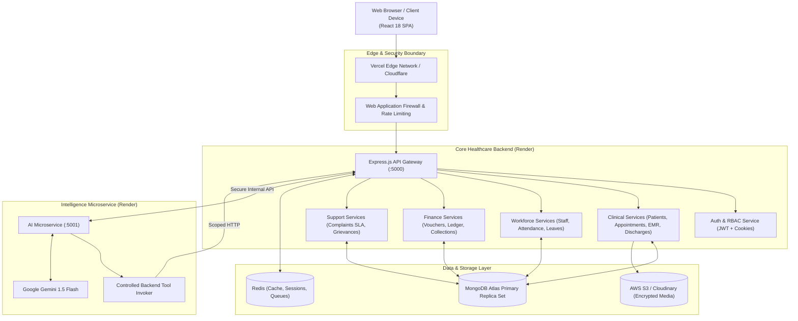

# High-Level Architecture Design (HLD)
**Hospital Management & Administration Platform (Super D)**
*Document Version: 1.0.0 (Production Foundation)*

---

## 1. System Vision & Business Objectives

The Super D Hospital Management & Administration Platform is an enterprise-scale multi-branch healthcare operational platform. It unifies clinical workflows, hospital administration, patient experience, workforce management, financial accounting, and growth marketing across a network of multi-speciality hospitals.

### Core Objectives
1. **Multi-Branch Operations**: Centralized oversight with localized operational autonomy across **Trichy**, **Chennai**, **Madurai**, and **Pudukkottai**.
2. **Role-Segregated Governance**: 9 distinct persona dashboards ensuring strict separation of duty between ownership, technical governance, and clinical operations.
3. **Data Integrity & Privacy**: Robust patient privacy boundaries complying with national digital health standards (DISHA / DPDP Act 2023 principles).
4. **Actionable Executive Intelligence**: Unified revenue reconciliations and AI-assisted analytics with strict human-in-the-loop clinical safety.

---

## 2. High-Level System Architecture

---

## 3. Core Functional Domains

### 3.1 Clinical Operations & EMR
- **Patient Management**: Central UHID registry formatted as `UHID-<BRANCH>-<YEAR>-<SUFFIX>`. Demographics, emergency contacts, status.
- **Appointments**: Token generation, schedule slots, conflict prevention, 5-stage appointment lifecycle.
- **Medical Records**: Doctor consultations, vitals tracking, prescription issuing, diagnosis records.
- **Discharge Summaries**: Inpatient admissions, treatment history, condition at discharge, digital consultant sign-off.

### 3.2 Workforce & Administration
- **Employee Directory**: Staff profiles, departmental allocations, branch assignments.
- **Attendance**: Daily check-in/out, biometric punch synchronization, late tracking.
- **Leave & Permissions**: Self-service requests, multi-tier approval workflow (Manager -> HR).
- **Complaints & Grievances**: Patient relations with SLA deadlines (24h/48h) and auto-escalation; confidential internal employee concerns.

### 3.3 Finance & Revenue
- **Income Receipts**: Billing categories (OP, Pharmacy, Lab, Day Care, Dressing, KIT, Inpatient).
- **Payment Reconciliation**: Cash, UPI, Card, Net Banking, and TPA Insurance cashless settlements.
- **Audit Adjustments**: Immutable reversal entries requiring reason and administrative notification.

### 3.4 Growth & Marketing
- **Advertisement Tracking**: Multi-platform ad spend across Google Ads, Meta Ads, and YouTube.
- **Leads & Enquiries**: Lead capture, specialty attribution, conversion tracking to patient registration.

### 3.5 Executive Intelligence (AI / RAG)
- **Controlled Backend Grounding**: Natural language query engine converting executive questions into authorized tool calls.
- **Human-in-the-Loop Safeguards**: Zero autonomous clinical prescriptions or diagnosis decisions.
