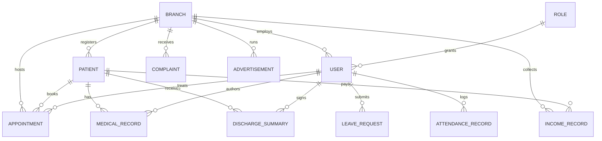

# Low-Level Architecture & Domain Schema Design (LLD)
**Hospital Management & Administration Platform (Super D)**
*Document Version: 1.0.0 (Production Foundation)*

---

## 1. Data Models & Entity Relationship Matrix



---

## 2. Core Domain Schemas & Indexing Strategies

### 2.1 Branch Entity (`branches`)
- **Collection**: `branches`
- **Fields**:
  - `branchId`: String (PK) (`branch-trichy`, `branch-chennai`, `branch-madurai`, `branch-pudukkottai`)
  - `name`: String
  - `code`: String (Unique, uppercase: `TRY`, `CHN`, `MDU`, `PDK`)
  - `city`: String
  - `bedCapacity`: Number
  - `departments`: Array of String
  - `isActive`: Boolean
- **Indexes**: `{ branchId: 1 }` (unique), `{ code: 1 }` (unique)

### 2.2 User & RBAC Entity (`users`, `roles`)
- **Collection**: `users`
- **Fields**:
  - `name`: String
  - `email`: String (Unique, lowercase)
  - `passwordHash`: String (bcrypt, salt rounds: 12)
  - `role`: String (Enum: `Hospital Owner`, `Global Admin`, `Doctor`, etc.)
  - `primaryBranchId`: String (FK -> `branches.branchId`)
  - `assignedBranches`: Array of String
  - `status`: String (`ACTIVE`, `DISABLED`, `PENDING`)
- **Indexes**: `{ email: 1 }` (unique), `{ primaryBranchId: 1, role: 1 }`

### 2.3 Patient Entity (`patients`)
- **Collection**: `patients`
- **Fields**:
  - `uhid`: String (Unique) (`UHID-TRY-2026-0042`)
  - `name`: String
  - `age`: Number
  - `gender`: Enum (`MALE`, `FEMALE`, `OTHER`)
  - `phone`: String (Indexed)
  - `branchId`: String (FK -> `branches.branchId`)
  - `status`: Enum (`ACTIVE`, `ADMITTED`, `DISCHARGED`, `INACTIVE`)
- **Indexes**: `{ uhid: 1 }` (unique), `{ phone: 1 }`, `{ branchId: 1, createdAt: -1 }`

### 2.4 Revenue Ledger Entity (`income_records`)
- **Collection**: `income_records`
- **Fields**:
  - `receiptNumber`: String (Unique) (`RCP-TRY-26-0082`)
  - `transactionDate`: Date (Indexed)
  - `category`: Enum (7 configured hospital billing heads)
  - `amount`: Number
  - `paymentMethod`: Enum (`Cash`, `UPI`, `Card`, `Net Banking`, `TPA Insurance`)
  - `branchId`: String (Indexed)
  - `status`: Enum (`ACTIVE`, `ADJUSTED`, `CANCELLED`)
- **Indexes**: `{ receiptNumber: 1 }` (unique), `{ branchId: 1, transactionDate: -1 }`, `{ category: 1 }`

---

## 3. Security & Middleware Pipeline

```
[Incoming Request]
       │
       ▼
 [1. Helmet & Secure Headers]
       │
       ▼
 [2. Strict CORS Verification] (Matches env.FRONTEND_URL)
       │
       ▼
 [3. Rate Limiter Middleware] (300 req / 15 min per IP)
       │
       ▼
 [4. Request ID Assignment] (UUIDv4 -> X-Request-Id)
       │
       ▼
 [5. JWT Authentication] (auth.middleware.ts -> populates req.user)
       │
       ▼
 [6. RBAC Permission Check] (rbac.middleware.ts -> requirePermission)
       │
       ▼
 [7. Multi-Branch Scope Filter] (scope.middleware.ts -> sets req.scopeFilter)
       │
       ▼
 [8. Zod Schema Validation] (validate.middleware.ts -> parses body/query/params)
       │
       ▼
 [9. Controller Execution] (Controller -> Service -> Repository -> MongoDB)
       │
       ▼
 [10. Standard JSON Response / Global Error Handler] (sendSuccess / errorHandler)
```
