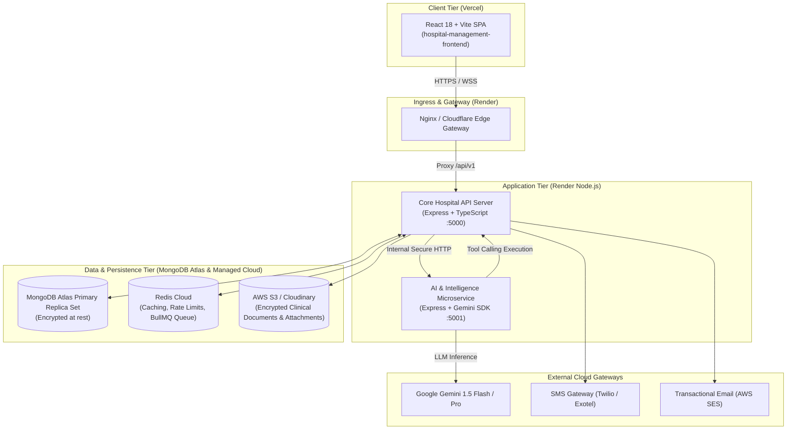

# Multi-Tier System Architecture Design
**Hospital Management & Administration Platform (Super D)**
*Document Version: 1.0.0 (Production Foundation)*

---

## 1. System Topology Overview

The Hospital Management & Administration Platform is architected as a decoupled, multi-tier distributed system designed for multi-branch scalability, high reliability, data privacy, and strict role segregation.



---

## 2. Tier Details & Responsibilities

### Tier 1: Frontend (Client Layer)
- **Deployment Platform**: Vercel (Edge Network)
- **Technology**: React 18, Vite 6, Tailwind CSS, Lucide Icons, Recharts.
- **Responsibilities**:
  - Render role-specific dashboards for 9 distinct administrative and clinical roles.
  - Client-side routing with route guards.
  - Present multi-branch operational tables, KPI cards, and charts.
  - Enforce UI validation before payload submission.
- **Branch Scope Handling**:
  - Injects `X-Branch-Context` header in all requests.
  - Allows Hospital Owner and Global Admin to switch to "All Branches" view.

### Tier 2: Backend API (Core Application Layer)
- **Deployment Platform**: Render (Web Service)
- **Technology**: Node.js, Express.js, TypeScript.
- **Responsibilities**:
  - Authoritative authentication, JWT verification, and password hashing (`bcryptjs`).
  - 5-Tier RBAC authorization (User -> Role -> Permissions -> Branch Scope -> Record Scope).
  - Authoritative Zod schema validation on all inputs.
  - Database persistence and transaction management via Mongoose.
  - Multi-branch data isolation via `scope.middleware.ts`.
  - Immutable audit logging of administrative and clinical events.
  - Exposing controlled HTTP tools to the AI Microservice.

### Tier 3: AI Microservice (Intelligence Layer)
- **Deployment Platform**: Render (Private Web Service)
- **Technology**: Node.js, Express.js, Google GenAI SDK (`@google/genai`).
- **CRITICAL SECURITY CONSTRAINT**:
  - The AI service **never** receives direct MongoDB connection credentials.
  - It interacts with the hospital platform solely through authorized, scoped backend tool endpoints (`getRevenueSummary`, `getBranchRevenue`, etc.).
  - Clinical decision support is strictly informational and requires human medical sign-off.

### Tier 4: Database & Storage (Persistence Layer)
- **Primary Database**: MongoDB Atlas (Replica Set with automated daily snapshots).
- **Object Storage**: AWS S3 or Cloudinary for X-rays, lab reports, discharge summaries, and receipt vouchers.
- **Cache & Queue**: Redis (BullMQ) for background job processing, SMS/Email queues, and 5-minute caching of executive aggregations.

---

## 3. Standardized Multi-Branch Identification

All database models, API query filters, and UI requests are standardized to the following four branch identifiers:

| Branch Name | Unique Identifier (`branchId`) | Branch Code | City |
| :--- | :--- | :---: | :--- |
| **Trichy Main Hospital** | `branch-trichy` | `TRY` | Tiruchirappalli |
| **Chennai Super Speciality** | `branch-chennai` | `CHN` | Chennai |
| **Madurai City Hospital** | `branch-madurai` | `MDU` | Madurai |
| **Pudukkottai Healthcare Center** | `branch-pudukkottai` | `PDK` | Pudukkottai |

---

## 4. Multi-Developer Team Workflow (3 Developers)

To ensure rapid, collision-free production development, the project is partitioned among three developers:

```
[Lead Architect / Coordinator]
        ├── Developer 1: Clinical Operations & EMR
        │   ├── Domain: Patients, Medical Records, Appointments, Doctors, Discharge Summaries
        │   ├── Branch: feature/member-1/*
        │   └── Core Files: backend/src/controllers/patient.controller.ts, appointment.controller.ts
        │
        ├── Developer 2: Workforce, Support & Operations
        │   ├── Domain: Employees, Daily Attendance, Leave Approvals, Complaints & Grievance SLA
        │   ├── Branch: feature/member-2/*
        │   └── Core Files: backend/src/controllers/employee.controller.ts, attendance.controller.ts, complaint.controller.ts
        │
        └── Developer 3: Finance, Growth & Executive Intelligence
            ├── Domain: Billing Ledgers, Income Records, Advertisements, Marketing Leads, AI Service
            ├── Branch: feature/member-3/*
            └── Core Files: backend/src/controllers/revenue.controller.ts, ai-service/src/*
```
