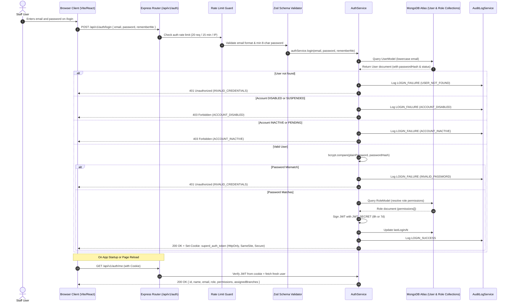
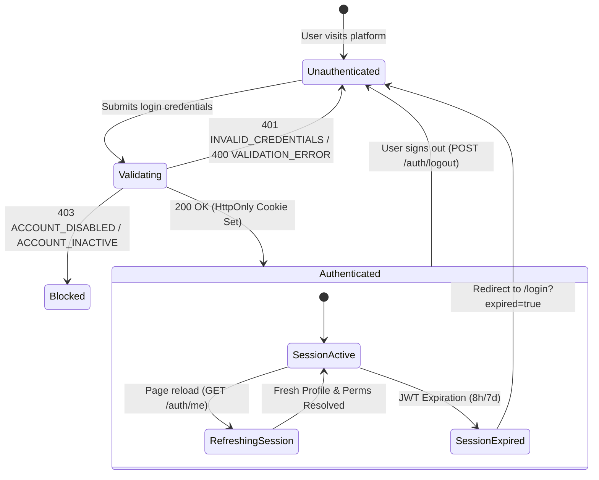
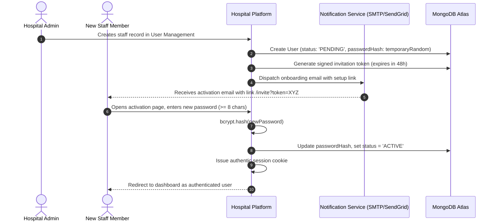

# Production-Grade Authentication & Authorization Specification

**Hospital Management & Administration Platform (Super D)**  
*Document Version: 1.0.0 — Production Specification*  
*Status: Approved & Implemented*  

---

## 1. Authentication Architecture

The Super D Hospital Management Platform adopts an **authoritative server-side session and identity model** using cryptographically signed JSON Web Tokens (JWT) transported via **secure, HttpOnly cookies**.



### Architectural Principles:
1. **Zero Client Authority**: The frontend never dictates or switches roles authoritatively. Role, permissions, and branch scopes are derived solely from the validated backend database records.
2. **XSS Protection**: Session tokens are isolated from JavaScript execution context via `HttpOnly` cookies. They cannot be read via `document.cookie` or exfiltrated by malicious scripts.
3. **Defense in Depth**: Password verification uses `bcrypt` with work factor 10, preventing brute force rainbow-table lookups.
4. **Dual Transport Support**: Browser clients authenticate automatically via `credentials: 'include'` cookies; non-browser API clients, mobile apps, and automated tests are supported via `Authorization: Bearer <token>`.

---

## 2. Login Flow

1. **Submission**: User enters their registered email and password on the `/login` screen.
2. **Autofill Helper**: During testing and staging, 7 pre-configured hospital staff personas can be clicked to automatically populate valid demo credentials (`demo2026@superd`). Clicking a persona never logs in directly; the user must click **Sign In** to execute real authentication.
3. **Payload Sanitization**: The input email is automatically normalized to lowercase and trimmed.
4. **Rate Limiting**: `authLimiter` limits authentication attempts to a maximum of 20 attempts per 15 minutes per IP.
5. **Backend Verification**:
   - Finds user record in MongoDB `users` collection.
   - Rejects inactive, pending, suspended, or disabled accounts.
   - Compares the plain password against the bcrypt hash.
   - Resolves effective permissions from all assigned roles.
   - Issues a cryptographically signed JWT.
6. **Cookie Delivery**: Transmits an `HttpOnly`, `SameSite` cookie containing the JWT.
7. **Session Store**: Frontend `AuthProvider` updates its authenticated state and routes to `/dashboard` or the originally requested protected path.

---

## 3. Session Strategy

| Parameter | Standard Session | Remember Me Session |
| :--- | :--- | :--- |
| **Duration** | 8 Hours | 7 Days (168 Hours) |
| **Storage Mechanism** | `HttpOnly` Cookie (`superd_auth_token`) | `HttpOnly` Cookie (`superd_auth_token`) |
| **Client Storage** | None (Zero localStorage / sessionStorage) | None (Zero localStorage / sessionStorage) |
| **Token Claims** | `userId`, `name`, `email`, `role`, `roles`, `primaryBranchId`, `assignedBranches`, `permissions` | Same |
| **Tamper Detection** | Cryptographic HMAC SHA-256 (`JWT_SECRET`) | Cryptographic HMAC SHA-256 (`JWT_SECRET`) |
| **Revocation** | Cleared on `POST /api/v1/auth/logout` | Cleared on `POST /api/v1/auth/logout` |

---

## 4. Cookie Configuration

Production cookie options configured in Express `auth.controller.ts`:

```typescript
const cookieOptions: CookieOptions = {
  httpOnly: true,                                       // Blocks JavaScript read access (XSS prevention)
  secure: env.COOKIE_SECURE,                            // Enforced true in production (HTTPS only)
  sameSite: env.COOKIE_SAMESITE as 'lax' | 'none',      // 'none' for cross-site Vercel -> Render HTTPS; 'lax' for local dev
  maxAge: rememberMe ? 7 * 24 * 3600 * 1000 : 8 * 3600 * 1000,
  path: '/',                                            // Scoped to all API and frontend endpoints
  ...(env.COOKIE_DOMAIN ? { domain: env.COOKIE_DOMAIN } : {}),
};
```

---

## 5. API Endpoints Contract

### 5.1 POST `/api/v1/auth/login`
Authenticates a user and issues an HttpOnly session cookie.

- **Rate Limit**: 20 requests per 15-minute window
- **Request Body**:
```json
{
  "email": "doctor.trichy@superd.demo",
  "password": "demo2026@superd",
  "rememberMe": false
}
```

- **Success Response (200 OK)**:
```json
{
  "success": true,
  "data": {
    "id": "664fa1...",
    "name": "Dr. Anand Kumar",
    "email": "doctor.trichy@superd.demo",
    "role": "Branch Doctor",
    "roles": ["Branch Doctor", "Doctor"],
    "permissions": [
      "patient.view",
      "patient.discharge",
      "medical_record.view",
      "medical_record.create",
      "appointment.view",
      "attendance.mark",
      "leave.request"
    ],
    "primaryBranchId": "branch-trichy",
    "assignedBranches": ["branch-trichy"],
    "status": "ACTIVE",
    "token": "eyJhbGciOiJIUzI1NiIsInR5cCI6IkpXVCJ9..."
  },
  "message": "Login successful."
}
```
*Note: `Set-Cookie: superd_auth_token=<JWT>; Path=/; HttpOnly; SameSite=Lax` header is attached.*

- **Failure Responses**:
  - `400 Bad Request`: `VALIDATION_ERROR` (malformed email, password < 8 characters)
  - `401 Unauthorized`: `INVALID_CREDENTIALS` (incorrect password or unregistered user)
  - `403 Forbidden`: `ACCOUNT_DISABLED` or `ACCOUNT_INACTIVE`
  - `429 Too Many Requests`: `AUTH_RATE_LIMIT`

---

### 5.2 GET `/api/v1/auth/me`
Validates the current session cookie and returns fresh user profile and permissions from the database.

- **Headers Required**: Automatic via `Cookie: superd_auth_token=...` or `Authorization: Bearer <token>`
- **Success Response (200 OK)**:
```json
{
  "success": true,
  "data": {
    "id": "664fa1...",
    "name": "Dr. Anand Kumar",
    "email": "doctor.trichy@superd.demo",
    "role": "Branch Doctor",
    "roles": ["Branch Doctor", "Doctor"],
    "permissions": ["patient.view", "medical_record.view", "..."],
    "primaryBranchId": "branch-trichy",
    "assignedBranches": ["branch-trichy"],
    "status": "ACTIVE"
  },
  "message": "Current session retrieved."
}
```
- **Failure Responses**:
  - `401 Unauthorized`: `UNAUTHORIZED` (session missing, forged, or expired)

---

### 5.3 POST `/api/v1/auth/logout`
Terminates the session and immediately instructs the browser to invalidate the cookie.

- **Success Response (200 OK)**:
```json
{
  "success": true,
  "data": {
    "loggedOut": true
  },
  "message": "Successfully logged out."
}
```
*Note: `Set-Cookie: superd_auth_token=; Path=/; Expires=Thu, 01 Jan 1970 00:00:00 GMT; Max-Age=0` header is attached.*

---

## 6. User Authentication Lifecycle



---

## 7. RBAC & Permissions Integration

Role-Based Access Control is enforced through a two-tier model:

1. **Backend Real Security Boundary (`requirePermission`, `requireRole`)**:
   - `Hospital Owner`, `Super Admin`, and `Global Admin` possess organization-wide authority.
   - For all other roles, the incoming request's `req.user.permissions` array is inspected against the required action (e.g. `patient.view`, `patient.discharge`, `revenue.create`).
   - If missing, the request is immediately terminated with `403 Forbidden` (`FORBIDDEN`).

2. **Frontend UX Protection (`ProtectedRoute`, `canRoleAccessRoute`)**:
   - Protects views and navigation items from unauthorized rendering.
   - Unauthorized navigation redirects to `/access-denied` (or `/unauthorized`), rendering the styled `AccessDeniedView` with an explicit list of allowed modules.
   - Modifying client state or attempting direct URL traversal cannot bypass the backend API filters.

---

## 8. Branch Scope Integration

Data isolation is guaranteed by `enforceScope` middleware:

1. **Organization-Scope Roles**: `Hospital Owner`, `Super Admin`, `Global Admin` can view consolidated data across all branches or filter by any branch.
2. **Branch-Scoped Roles**: `Branch Manager`, `Branch Doctor`, `Staff`, `Employee`.
   - Backend derives authorized branches strictly from `req.user.assignedBranches`.
   - If a branch-scoped user attempts to request data for another branch (e.g. `branch-chennai` when assigned to `branch-trichy`), the backend immediately rejects with:
     ```json
     {
       "success": false,
       "error": {
         "code": "FORBIDDEN",
         "message": "Cross-branch access violation. You do not have authorization to access records for branch 'branch-chennai'."
       }
     }
     ```

---

## 9. Error Handling & Standardization

All authentication errors conform to the standardized error envelope:

```json
{
  "success": false,
  "error": {
    "code": "INVALID_CREDENTIALS",
    "message": "Invalid email or password.",
    "requestId": "630e446e-c073-4e57-9bba-bab659b8b02b"
  }
}
```

### Supported Authentication Codes:
- `INVALID_CREDENTIALS`: Email not registered or password does not match hash.
- `ACCOUNT_DISABLED`: Account status is `DISABLED` or `SUSPENDED`.
- `ACCOUNT_INACTIVE`: Account status is `INACTIVE` or `PENDING`.
- `UNAUTHORIZED`: Request missing session cookie / Bearer token, or token expired.
- `FORBIDDEN`: User lacks permissions or branch authorization.
- `VALIDATION_ERROR`: Zod schema constraint failure.
- `AUTH_RATE_LIMIT`: Exceeded maximum 20 login attempts per 15 minutes.
- `NETWORK_ERROR`: Browser client unable to connect to the backend server.

---

## 10. Security Controls

1. **Password Hashing**: `bcryptjs` with salt round 10.
2. **Zero Plaintext Credentials**: Plaintext passwords never touch database persistence or logs.
3. **Fail-Fast Secret Key**: If `JWT_SECRET` is unset or contains fallback in production, the application crashes immediately upon boot.
4. **No Secrets in Frontend**: Zero secrets, private keys, or API tokens bundled into Vite bundle.
5. **No Wildcard CORS**: CORS explicitly checks `FRONTEND_URL`, rejects wildcard `*` with credentials.
6. **HttpOnly & SameSite**: Session cookies cannot be accessed via JavaScript `document.cookie`.
7. **Rate Limiting**: Login routes protected by dedicated `authLimiter`.
8. **Audit Logging**: Authentication events (`LOGIN_SUCCESS`, `LOGIN_FAILURE`, `LOGOUT`) are stored in `audit_logs` collection without storing secrets.

---

## 11. Environment Variables Specification

### Backend (`backend/.env`):
```bash
# Server Runtime
NODE_ENV=development
PORT=5000

# Database
MONGODB_URI=mongodb://localhost:27017/superd_hospital_dev

# JWT & Authentication
JWT_SECRET=production_random_secret_minimum_32_chars_long
JWT_EXPIRES_IN=8h

# Session Cookie
COOKIE_NAME=superd_auth_token
COOKIE_SECURE=false             # Set to true in production (HTTPS)
COOKIE_SAMESITE=lax             # Set to 'none' in production cross-origin setup
COOKIE_DOMAIN=                  # Optional domain scope (e.g. .superd.com)

# CORS
FRONTEND_URL=http://localhost:3000
```

### Frontend (`frontend/.env`):
```bash
VITE_API_BASE_URL=http://localhost:5000/api/v1
```

---

## 12. Testing & Verification

Automated test suite is maintained in `backend/tests/auth.test.ts`.

### Execution:
```powershell
npm run test --prefix backend
```

### Validated Test Cases:
1. `POST /auth/login` with valid credentials -> sets `HttpOnly` cookie, returns sanitized user object without passwords.
2. `POST /auth/login` with wrong password -> returns 401 `INVALID_CREDENTIALS`.
3. `POST /auth/login` with unknown user -> returns 401 `INVALID_CREDENTIALS`.
4. `POST /auth/login` with inactive user -> returns 403 `ACCOUNT_INACTIVE`.
5. `POST /auth/login` with suspended user -> returns 403 `ACCOUNT_DISABLED`.
6. `POST /auth/login` missing email -> returns 400 `VALIDATION_ERROR`.
7. `POST /auth/login` missing password -> returns 400 `VALIDATION_ERROR`.
8. `POST /auth/login` malformed email -> returns 400 `VALIDATION_ERROR`.
9. `POST /auth/login` password < 8 characters -> returns 400 `VALIDATION_ERROR`.
10. `GET /auth/me` with valid `HttpOnly` cookie -> returns 200 OK and fresh user profile.
11. `GET /auth/me` with Bearer token header -> returns 200 OK.
12. `GET /auth/me` with no session -> returns 401 `UNAUTHORIZED`.
13. `GET /auth/me` with forged signature -> returns 401 `UNAUTHORIZED`.
14. `POST /auth/logout` -> clears session cookie (`Max-Age=0`).
15. Authenticated role strictly loaded from database (not from client).
16. Dynamic permissions resolved correctly from `roles` collection.
17. Branch scope strictly assigned from database records.
18. Privilege Escalation Prevention: Cross-branch access denied with 403 `FORBIDDEN`.

---

## 13. Future Password Reset & User Invitation Flow

The architecture is prepared for the Phase 2 user provisioning workflow:


